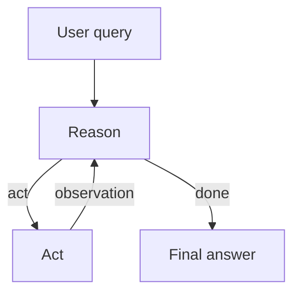
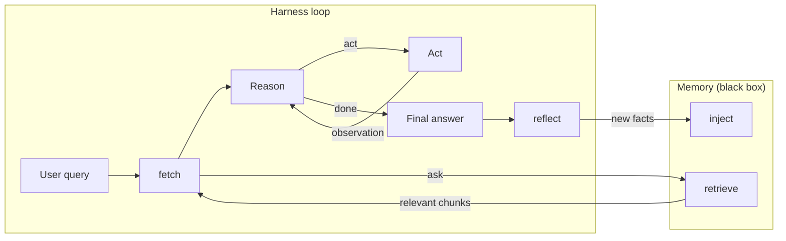

# Knowcards

### Local-first durable facts for coding agents, reinjected as trusted memory

> "A computer program is said to learn from experience E with respect to some class of tasks T and performance measure P, if its performance at tasks in T, as measured by P, improves with experience E."
> — Tom Mitchell

> **Alpha** — this package is early. The API and host hook shapes may change.
>
> [Star this repo](https://github.com/manojbajaj95/agent-knowledge-cards) to stay in the loop as we ship.

[](https://www.npmjs.com/package/knowcards)
[](https://www.npmjs.com/package/knowcards)
[](https://github.com/manojbajaj95/agent-knowledge-cards)
[](https://nodejs.org/)
[](https://code.claude.com/docs/en/hooks)
[](https://developers.openai.com/codex/hooks)
[](https://cursor.com/docs/hooks)
[](LICENSE)

[Highlights](#highlights) · [Quick start](#quick-start) · [Agent protocol](#agent-protocol) · [How it works](#how-it-works) · [Docs](#docs)

---

## Highlights

> **Knowcards = project-local markdown facts + automatic inject/reflect on supported hosts.**
>
> - **Filesystem-first** — cards are plain markdown under `.agents/knowledge_cards`. No DB, no vectors.
> - **Trusted memory** — hits are preferred over rediscovery or a conflicting README unless the card is stale.
> - **Host edges** — `install` wires Claude Code / Codex / Cursor hooks and a Pi extension; CLI and MCP remain for manual use.

Coding agents forget between sessions. They re-grep the tree, re-read the README, and still miss the constraint that mattered last time. That wastes tokens and wall clock — and fails when the workspace is wrong.

Knowcards keeps those facts as local cards and reinjects them. The agent prefers the card unless new evidence shows it is wrong.

---

## Quick start

```bash
# Install automatic inject + reflect hooks (pick your host)
npx knowcards install cursor
npx knowcards install claude-code
npx knowcards install codex
npx knowcards install pi

# Write a durable fact (creates dirs if needed)
npx knowcards propose --title "JWT auth header" \
  "JWTs go in the Authorization header"

# Change or remove a card
npx knowcards update jwt-auth-header --title "JWT auth header" \
  "JWTs go in the Authorization header as Bearer"
npx knowcards delete jwt-auth-header

# Search the local card library
npx knowcards query jwt

# Show notebook paths and card counts
npx knowcards status

# MCP stdio server (for host config below)
npx knowcards mcp
```

Cards live at `.agents/knowledge_cards/<notebook-id>/*.md`:

```markdown
---
title: Payment amounts are integer cents
---

Amounts are stored as integer cents; never use floating point for money.
```

Optional: put a custom reflection prompt in project-root `REFLECT.md`. If missing, knowcards uses the packaged default.

### MCP

```json
{
  "mcpServers": {
    "knowledge-cards": {
      "command": "npx",
      "args": ["knowcards", "mcp"]
    }
  }
}
```

Install the [knowcards skill](skills/knowcards/SKILL.md) (or equivalent host instructions) so the agent can still query/propose mid-session without hooks.

---

## Agent protocol

With hooks installed, inject and end-of-session reflect run automatically. The manual loop still works:

1. **Before acting** — `npx knowcards query "<keywords>"` (or the MCP tool). Skip only for routine edits in code you already hold.
2. **Apply hits** — Prefer card facts. Verify against the repo when a card may be old.
3. **Propose at end** — Write durable facts from the *outcome* (what proved true), not the path you took. One atomic fact per card.

Do not propose plans or unverified guesses. Near-duplicates are fine; bookkeeping is separate.

---

## How it works

A typical ReAct agent takes a user query, then reasons and acts in a loop, then gives a final answer. It does not read or write durable memory.



Knowcards wraps that loop. After the user query, `fetch` asks memory for relevant chunks through `retrieve`. After the final answer, `reflect` writes new facts through `inject`. Memory is a black box in this view.



The `install` command wires Claude Code, Codex, or Cursor hooks, or a Pi extension. A prompt retrieves matching cards (MiniSearch) and injects titles. Use `query` or MCP for the full text. After the final answer, Stop (or Pi `agent_end`) continues the same session so the agent can propose. Cards are markdown under `.agents/knowledge_cards`. Knowcards does not bundle an LLM.

- `src/core/` and `src/lifecycle/` — memory
- `src/adapters/` — host hook envelopes
- `src/mcp/` and `src/cli/` — memory API; `install` is adapter wiring

---

## Docs

| Document                         | Contents                                      |
| -------------------------------- | --------------------------------------------- |
| [`CONTRIBUTING.md`](CONTRIBUTING.md) | Setup, Harbor evals, how to contribute     |
| [`SECURITY.md`](SECURITY.md)     | How to report a vulnerability                 |
| [`AGENTS.md`](AGENTS.md)         | Conventions for agents working in this repo   |
| [`eval/README.md`](eval/README.md) | Harbor A/B (bare Pi vs extension + CLI) |
| [`skills/knowcards/SKILL.md`](skills/knowcards/SKILL.md) | Agent skill: when to query / propose |

## License

MIT. See [LICENSE](LICENSE).

Author: [mbajaj_](https://twitter.com/mbajaj_)
